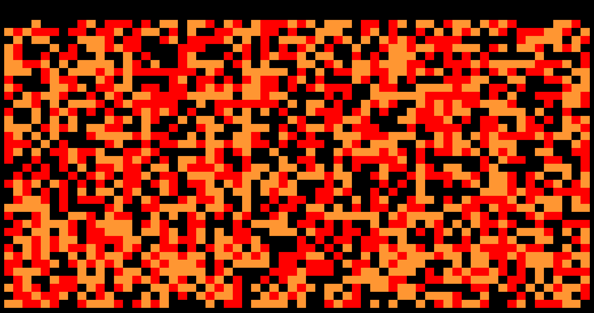

# Generated Graphics
Algorithmically generating some cool 2D visuals while learning some modern OpenGL!

**Depth-first search Maze Generation**
Large:

Small and Wacky:

**Cyclic Cellular Automation**
Rule 313 discovered by David Griffeath:

**Fractal Tree**
Binary branching and depth of 10:

**Possible ideas for the future:**
-some visual demonstration of perlin noise
-water ripples (perhaps integrate with mouse)
-campfire burning
-aerial view of fire propegation (perhaps integrate with mouse)
